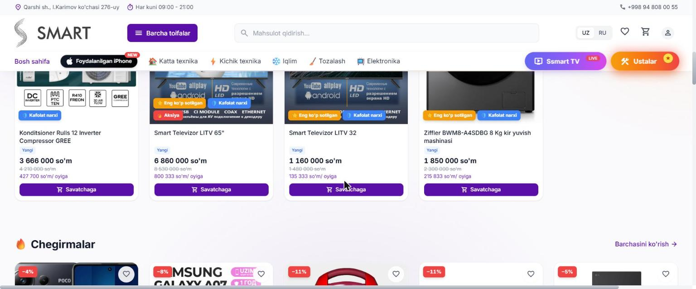

# SSMART — online store, live TV channel, and in-store terminals

**[ssmart.uz](https://ssmart.uz/)** · in production for an appliance and electronics retailer in Qarshi, Uzbekistan

Not a single storefront but three connected systems: the customer-facing shop, a live shopping channel with its own admin, and a desktop terminal application running in the physical store.

---

## The problem

The company sold from a physical shop in Qarshi. Customers outside the city had no way to browse stock or compare prices, and almost every purchase in this market is made on instalments — so a price tag alone doesn't answer the question people actually have, which is *what do I pay per month?*

Selling appliances also doesn't end at checkout. A washing machine needs installing, a customer wants to see the product demonstrated, and staff on the shop floor need the same catalogue the website has.

---

## The three systems

### 1. The storefront

A React 19 SPA served by its own **Express** layer, which handles API routes and serves the built client with compression.

**Catalogue** — large appliances, small appliances, climate, cleaning, electronics, and a separate section for used iPhones, with search across everything.

**Instalment pricing on every card** — alongside the price, each product shows its monthly payment at 0% over 12 months. The calculation runs on the product list, not just the detail page, so the comparison customers care about is visible while browsing.

**Cart, wishlist, and accounts** — favourites, cart state, and order history per user.

**Merchandising** — discounts and badges for promotions, best sellers, warranty pricing, and new arrivals, all driven by product data so staff can run a promotion without a deploy.

**Ustalar** — booking installation and repair technicians, which for appliances is part of the purchase rather than an afterthought.

### 2. SSMART TV

A live shopping channel embedded in the storefront, with a **separate admin application** for managing the broadcast and its content. Live commerce is common in this market and the channel runs as its own system rather than a widget bolted onto the shop.

### 3. TV Terminal — desktop application

An **Electron** application packaged as a portable Windows executable with electron-builder, running on terminals in the physical store. Distributed with setup scripts and its own installation guide, because the people installing it are shop staff, not engineers.

It reads and writes Excel via SheetJS, so stock and pricing data moves between the terminal and the office in a format the business already uses.

---

## Frontend work

- **Product listing at scale** — category pages, search, filtering, and image-heavy grids that stay fast on mobile connections
- **Instalment calculation** rendered per product across the whole catalogue
- **Cart and wishlist state** persisted across sessions
- **Live video integration** for the TV channel
- **Sales dashboards** with Recharts
- **Uzbek and Russian** via i18next with browser language detection, covering product data as well as UI strings
- **Desktop packaging** — Electron build targets, portable output, and install scripts for non-technical staff

## Design decisions worth noting

Monthly payment is shown on the card, not hidden behind a click. It's one extra number per product and it removes the main reason a customer would leave to phone the shop.

The TV channel and the terminal are separate applications rather than modes of the storefront. They have different users, different lifecycles, and one of them ships as a Windows binary — folding them into the web app would have coupled three release schedules together.

---

## Stack

**Web** `React 19` `Vite` `Tailwind CSS 4` `React Router 7` `Express` `i18next` `Recharts`
**Desktop** `Electron` `electron-builder` `SheetJS`

---

*Source code is private — this repository documents the work.*
